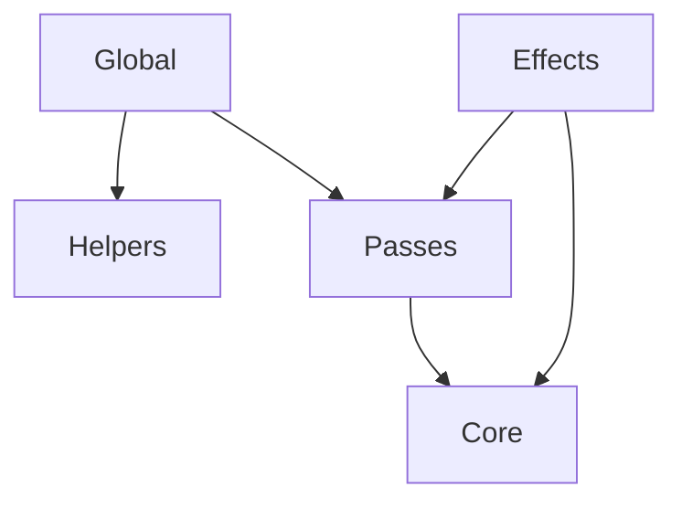

# API overview

## Modules

| Name                  | Description                             |
| --------------------- | --------------------------------------- |
| [Global](./global/)   | High-level entry points.                |
| [Passes](./passes/)   | Different kinds of rendering pipelines. |
| [Core](./core/)       | Low-level WebGL primitives.             |
| [Effects](./effects/) | Built-in post-processing effects.       |
| [Helpers](./helpers/) | Utility functions not related to WebGL. |
| [Types](./types/)     | Shared types.                           |

 

